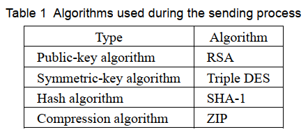

# ITPEC_FE_2021S_PM
## 問1
> Q1. Read the following description of the use of public-key cryptography in e-mail
communications, and then answer Subquestions 1 and 2.

　以下，メールにおける公開鍵暗号方式の説明を読んで，設問１および２に解答せよ．

> Pretty Good Privacy (PGP) was developed to enhance privacy, integrity, and authentication
of e-mail communications. The term “PGP” refers not only to the protocol specification, but
it also refers to the name of software package. There are open source implementations of
PGP (e.g., OpenPGP and GPG) as well. However, for the purpose of this question, all
implementations are simply referred to as “PGP”.

　Pretty Good Privacy(PGP)はプライバシーおよび保全性の強化，メールでの認証を行うために開発された．`PGP`という言葉はプロトコル仕様からだけでなく，ソフトウェアパッケージ名からもきている．同様にオープンソースで実装されているものも存在する．（例えば，OpenPGPやGPGなど）しかしながら，この問題の目的のため，すべての実装は単に`PGP`として呼ばれている．

> PGP combines the use of public- and secret-key cryptography to provide message protection and authentication. It also employs data compression to reduce the size of messages.
Figure 1 demonstrates the process in which Alice sends a confidential message to Bob.

　PGPは公開鍵および秘密鍵を用いた暗号方式が利用されている．その目的はメッセージの秘匿化と認証である．また通信データサイズを減らすために，圧縮が行われる．
図1はアリスがボブに機密データを送信する手順を示したものである．

※ Encrypted : 暗号化された , Signed : 署名された

※ 図1 アリスがボブに機密データを送信する手順

> In PGP, the confidentiality of the message is achieved through the use of a transaction key,
> also known as a shared-session key. This key is a random number created on the sender’s
> side through the use of arbitrary keystrokes as the seed. It is used only once with this
> particular message. One of the reasons for using transaction keys is that symmetric-key
> encryption is more efficient than public-key encryption when encrypting larger messages.
> Meanwhile, authenticity and integrity of the message are ensured via the use of public keys.  

　PGPでは，メッセージの機密性は共有されたセッションキー（時間制限付きの共通鍵）として知られているトランザクションキーを用いることで実現されている．この鍵は送信者側で生成された乱数を用いている．この乱数は恣意的なキーボードの操作を元に作られる．これはこの特定のメッセージでたった一度だけ使用される．トランザクションキーを利用する理由の一つとして，大きなデータ量を暗号化する際には，共通鍵暗号は公開鍵暗号よりも効率的であることがあげられる．一方で，メッセージの信頼性と保全性は公開鍵を用いることによって保障されている．

> Here, the message is compressed using a compression algorithm. Then, the message digest
> is created using a hash algorithm from the compressed message and is signed with the
> sender’s private key, which forms a digital signature. The entire packet of the compressed
> message and the signed message digest are then encrypted with the transaction key. The
> transaction key is required for message decryption and must be sent with the message. Thus,
> it is encrypted with the recipient’s public key to ensure that the recipient is the only person
> able to use the transaction key.  

　このメッセージは圧縮アルゴリズムを用いて圧縮されている．そして，このメッセージダイジェスト(ハッシュ値)は圧縮されたメッセージからハッシュアルゴリズムを用いて作成されている．そして，送信者の秘密鍵で署名されている．この署名はディジタル署名の形式で作成される．

　メッセージが圧縮されたすべてのパケットと署名されたメッセージダイジェスト(ハッシュ値)はトランザクションキーで暗号化される．そのトランザクションキー(時間制限付きの共通鍵)は復号時に利用される．そして，メッセージとともに送信されなければならない．

したがって，受信者の公開鍵で暗号化するということは，受信者がトランザクションキーを唯一利用できる人であることを確認するということである．

> The algorithm used in each step was selected at send time. Although multiple algorithms
> are available to choose from, the ones used in this example are shown in table 1.  

手順ごとで利用されるこのアルゴリズムは送信時に選択される．とはいえ，多くのアルゴリズムは表1で示す例のなかで選択することが可能である．

表1 送信処理中に利用されるアルゴリズム

| アルゴリズムの種類   | アルゴリズム |
| -------------------- | ------------ |
| 公開鍵アルゴリズム   | RSA          |
| 共通鍵アルゴリズム   | 3DES         |
| ハッシュアルゴリズム | SHA-1        |
| 圧縮アルゴリズム     | ZIP          |

> After Bob receives the message from Alice, all processes are reversed. First, the transaction
> key must be decrypted with ___A___ using the ___B___ algorithm. Second, the
> transaction key is used to decrypt the message’s envelope, which contains both the
> compressed message and the signed message digest. Third, Bob must create a message
> digest of the compressed message using ___C___, and compares the result with the
> message digest verified using the RSA algorithm and ___D___. This is performed to
> ensure the authenticity and integrity of the message. Finally, the message is uncompressed
> to obtain the original message sent by Alice.  

　ボブがアリスからメッセージを受け取った後で，すべての処理は逆方向で実行される．

　まず1つ目にトランザクションキー(一時的な共通鍵)は **B** のアルゴリズム使って **A** とともに復号されなければならない．

　次に2つ目として，トランザクションキーはメッセージのエンベローブ(制御情報)を復号するために利用される．これは圧縮されたメッセージおよび署名されたメッセージダイジェスト(ハッシュ値)を含んでいる．

　3つ目として，ボブは **C** を用いることで圧縮されたメッセージのメッセージダイジェストを作成しなければならない．そして，RSAアルゴリズムおよび **D** で検証されたメッセージダイジェストを用いて，結果を比較しなければならない．

　これはメッセージの信頼性と保全性を強化するために行われる．

　最終的に，このメッセージはアリスによって送信されたオリジナルのメッセージを得るために解凍(展開, 非圧縮化)される．

> [Web of trust]  

[Web Of Trust(WOT)モデル]

> With PGP, each party is required to maintain individual keyrings, mapping each e-mail
> address to its public key. Typically, e-mail clients automate the key selection process but it
> is the user’s duty to gather and exchange public keys among related parties rather than using
> a centralized server. Each entity in the keyring will be either fully trusted, partially trusted
> or untrusted. Each user can also sign their contact’s public key and send to another party for
> introduction. For example, if Alice wants to introduce Mark to Bob, then Mark’s public key
> will be signed with ___E___ and sent to Bob. Ultimately, this will form a web of trust
> that will enable a large circle of people to communicate securely with one another.  

　PGPを用いることで，当事者たちは個人のe-mailアドレスごとの公開鍵をキーリング(鍵の保管)を維持することが要求される．

　通常，e-mailのクライアントソフトは自動的に鍵を選択する．しかし，一元化したサーバを用いるのではなく，関係者間の公開鍵を収集・交換するのはユーザーの責任である．キーリングのどの要素も完全に信頼される状態や部分的に信頼された状態だけでなく，信頼されていない状態もある．

　それぞれのユーザーが公開鍵の署名し，最初に送受信をおこなう相手に送るべきである．

　例えば，

