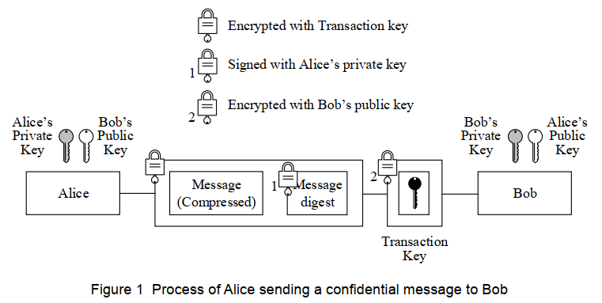

# ITPEC_FE_2021S_PM
## 問1
> Q1. Read the following description of the use of public-key cryptography in e-mail
communications, and then answer Subquestions 1 and 2.

　以下，メールにおける公開鍵暗号方式の説明を読んで，設問１および２に解答せよ．

> Pretty Good Privacy (PGP) was developed to enhance privacy, integrity, and authentication
of e-mail communications. The term “PGP” refers not only to the protocol specification, but
it also refers to the name of software package. There are open source implementations of
PGP (e.g., OpenPGP and GPG) as well. However, for the purpose of this question, all
implementations are simply referred to as “PGP”.

　Pretty Good Privacy(PGP)はプライバシーおよび保全性の強化，メールでの認証を行うために開発された．`PGP`という言葉はプロトコル仕様からだけでなく，ソフトウェアパッケージ名からもきている．同様にオープンソースで実装されているものも存在する．（例えば，OpenPGPやGPGなど）しかしながら，この問題の目的のため，すべての実装は単に`PGP`として呼ばれている．

> PGP combines the use of public- and secret-key cryptography to provide message protection and authentication. It also employs data compression to reduce the size of messages.
Figure 1 demonstrates the process in which Alice sends a confidential message to Bob.

　PGPは公開鍵および秘密鍵を用いた暗号方式が利用されている．その目的はメッセージの秘匿化と認証である．また通信データサイズを減らすために，圧縮が行われる．
図1はアリスがボブに機密データを送信する手順を示したものである．

※ Encrypted : 暗号化された , Signed : 署名された

※ 図1 アリスがボブに機密データを送信する手順

> In PGP, the confidentiality of the message is achieved through the use of a transaction key,
> also known as a shared-session key. This key is a random number created on the sender’s
> side through the use of arbitrary keystrokes as the seed. It is used only once with this
> particular message. One of the reasons for using transaction keys is that symmetric-key
> encryption is more efficient than public-key encryption when encrypting larger messages.
> Meanwhile, authenticity and integrity of the message are ensured via the use of public keys.  

　PGPでは，メッセージの機密性は共有されたセッションキー（時間制限付きの共通鍵）として知られているトランザクションキーを用いることで実現されている．この鍵は送信者側で生成された乱数を用いている．この乱数は恣意的なキーボードの操作を元に作られる．これはこの特定のメッセージでたった一度だけ使用される．トランザクションキーを利用する理由の一つとして，大きなデータ量を暗号化する際には，共通鍵暗号は公開鍵暗号よりも効率的であることがあげられる．一方で，メッセージの信頼性と保全性は公開鍵を用いることによって保障されている．

> Here, the message is compressed using a compression algorithm. Then, the message digest
> is created using a hash algorithm from the compressed message and is signed with the
> sender’s private key, which forms a digital signature. The entire packet of the compressed
> message and the signed message digest are then encrypted with the transaction key. The
> transaction key is required for message decryption and must be sent with the message. Thus,
> it is encrypted with the recipient’s public key to ensure that the recipient is the only person
> able to use the transaction key.  

　このメッセージは圧縮アルゴリズムを用いて圧縮されている．そして，このメッセージダイジェスト(ハッシュ値)は圧縮されたメッセージからハッシュアルゴリズムを用いて作成されている．そして，送信者の秘密鍵で署名されている．この署名はディジタル署名の形式で作成される．

　メッセージが圧縮されたすべてのパケットと署名されたメッセージダイジェスト(ハッシュ値)はトランザクションキーで暗号化される．そのトランザクションキー(時間制限付きの共通鍵)は復号時に利用される．そして，